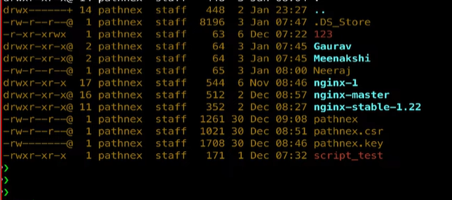
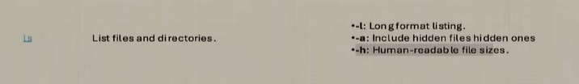

## Current Directory Command

To see your current directory in Linux, use:

```bash
pwd
```

This command prints the **present working directory**.

==========================
## List Folders with Tab Completion

To view all folders in the current directory, type:

```bash
ls -d */
```

You can also start typing a folder name and press `Tab` for auto-completion in the terminal.
======================
## List Files and Folders

To list all files and folders in the current directory, use:

```bash
ls
```

## Detailed Listing with `ls -l`

For a detailed listing that shows permissions, date, time, and size, use:

```bash
ls -l
```

This command provides comprehensive information about each file and folder.
=======================================
## Create a New Folder

To make a new folder in Linux, use:

```bash
mkdir folder_name
```

Replace `folder_name` with the name you want for your folder.

====================================

## Absolute and Relative Paths

### Absolute Path

An absolute path specifies the full location of a file or folder from the root directory (`/`).  
Example:

```bash
cd /home/user/documents
```

This command moves to the `documents` folder using the complete path.

### Relative Path

A relative path specifies the location relative to your current directory.  
Example:

```bash
cd ../projects
```

This command moves up one directory and then into the `projects` folder.

> **Tip:** An absolute path always starts from the root directory (`/`).  
> Think of it as "root se" (from the root) — it shows the complete route to your file or folder.

=====================

## Remove Files and Folders

To delete a file in Linux, use:

```bash
rm filename
```

To forcefully delete a file or folder (without confirmation), use:

```bash
rm -f filename
```

You can specify the path along with the file or folder name to remove it:

```bash
rm /path/to/file_or_folder
```

> **Caution:** Use `rm -f` carefully, as it permanently deletes files or folders without asking.

# Documentation Comment

- `rm -r`: The `rm` command is used to remove files or directories in Unix/Linux systems.
- The `-r` (or `--recursive`) option allows `rm` to remove directories and their contents recursively, meaning it will delete the directory and all files and subdirectories within it.
- Use with caution, as deleted files and directories cannot be easily recovered.
================================================
## What is the `vim` Command?

The `vim` command opens the Vim text editor in the terminal. Vim is a powerful editor used to create and edit files.

Example:

```bash
vim filename
```

Replace `filename` with the name of the file you want to edit. If the file does not exist, Vim will create it.

> **Tip:** Vim is useful for editing configuration files and scripts directly from the terminal.
## Save and Exit in Vim

To write (save) changes and exit Vim, press:

```
Esc :wq
```

- `Esc` switches to command mode.
- `:wq` writes (saves) the file and quits Vim.
## Exit Vim Without Saving

If you want to exit Vim without saving changes, press:

```
Esc :q!
```

- `Esc` switches to command mode.
- `:q!` quits Vim and discards any changes made.
- Use this when you do not want to save your edits.
==========================

 understand all line why 
==========================



===============================
## What Does the `.` (Dot) Represent?

In Linux, the `.` (dot) refers to your **current directory**.  
Wherever you are in the terminal, `.` points to that location.

Example:

```bash
ls .
```

This command lists files and folders in your present directory.

> **Tip:** Use `.` when you want to refer to your current location in commands.
==============================
## The `head` and `tail` Commands

### `head` Command

The `head` command displays the first few lines of a file (default is 10 lines).

Example:

```bash
head filename.txt
```

To show the first 5 lines:

```bash
head -n 5 filename.txt
```

### `tail` Command

The `tail` command displays the last few lines of a file (default is 10 lines).

Example:

```bash
tail filename.txt
```

To show the last 5 lines:

```bash
tail -n 5 filename.txt
```

> **Tip:** Use `head` and `tail` to quickly preview the beginning or end of large files.

=======================
## What is a Soft Link (Symbolic Link)?

A **soft link** (also called a **symbolic link**) is a shortcut or reference to another file or folder in Linux. It points to the original file, allowing you to access it from a different location.

To create a soft link, use:

```bash
ln -s target_file link_name
```

- `target_file`: The original file or folder.
- `link_name`: The name of the soft link.

### Uses of Soft Links

- Access files from multiple locations without duplicating them.
- Easily manage shared resources.
- Useful for organizing files and directories.

### How Many Soft Links Can You Create?

You can create **unlimited soft links** to a file or folder. There is no restriction on the number of symbolic links pointing to the same target.

> **Tip:** If the original file is deleted, the soft link becomes broken and will not work.

==========================
## What is the `ln` Command and Its Uses?

The `ln` command in Linux is used to create links between files and directories. There are two types of links:

- **Hard Link:** Creates another name for a file. Both names point to the same data on disk.
- **Soft Link (Symbolic Link):** Creates a shortcut or reference to another file or folder.

### Common Uses of `ln`

- Organize files by creating shortcuts.
- Access files from different locations.
- Manage shared resources without duplicating files.

### Examples

**Create a hard link:**
```bash
ln original_file hard_link_name
```

**Create a soft link:**
```bash
ln -s original_file soft_link_name
```

> **Tip:** Soft links are useful for shortcuts, while hard links are used for backup and redundancy.

==========================
## The `cat` Command and Its Uses

The `cat` (concatenate) command is used to display the contents of files, combine multiple files, and create new files.

### Common Uses

- View the contents of a file.
- Combine files into one.
- Create a new file.

### Examples

**Display a file's contents:**
```bash
cat filename.txt
```

**Combine two files into a new file:**
```bash
cat file1.txt file2.txt > combined.txt
```

**Create a new file:**
```bash
cat > newfile.txt
```
(Type your text, then press `Ctrl+D` to save and exit.)

> **Tip:** `cat` is handy for quickly viewing or merging files in the terminal.

==================
## Hard Link: Uses and How-To

A **hard link** creates another name for a file, both pointing to the same data on disk. Changes made through any hard link affect the original file.

### Uses of Hard Links

- Backup: Create multiple references to important files.
- Redundancy: Access the same file from different locations.
- Efficient storage: No duplication of file data.

### How to Create a Hard Link

```bash
ln original_file hard_link_name
```

- `original_file`: The file you want to link.
- `hard_link_name`: The new name for the hard link.

**Example:**

```bash
ln notes.txt backup_notes.txt
```
This creates a hard link called `backup_notes.txt` pointing to `notes.txt`.

---

## Difference Between Hard Link and Soft Link

| Feature         | Hard Link                          | Soft Link (Symbolic Link)           |
|-----------------|------------------------------------|-------------------------------------|
| Points to       | File data (inode)                  | File name/path                      |
| Works across FS | No (same filesystem only)          | Yes (can cross filesystems)         |
| Broken if target deleted | No (data remains)         | Yes (link breaks)                   |
| Can link dirs   | No                                 | Yes                                 |
| Command         | `ln original_file link_name`        | `ln -s original_file link_name`     |

> **Tip:** Use hard links for redundancy and backups; use soft links for shortcuts and flexible access.

===============================

