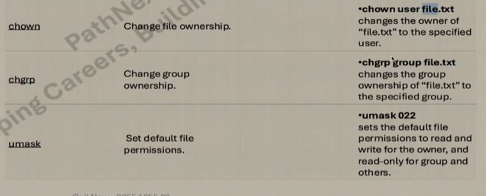
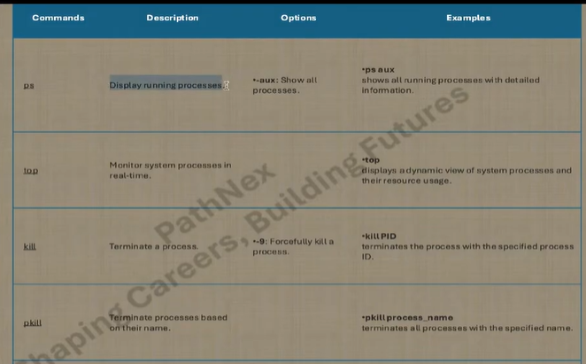
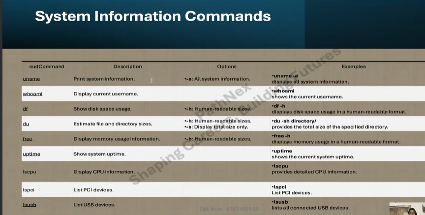
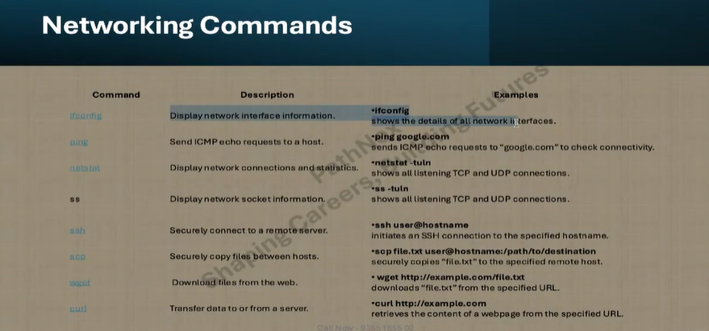

To search for a folder by name using `find`, use:

```bash
find . -type d -name "<folder_name>"
```

Replace `<folder_name>` with the name you want to search for.
===================================
The dot (`.`) in the command tells `find` to start searching from the current directory and look in all its subdirectories.
===================================

The `chmod` command is used to change the permissions of files and directories. Its basic syntax is:

```bash
chmod <permissions> <file_or_directory>
```

- `<permissions>` can be specified using either symbolic notation (like `u+rwx`, `g-w`, etc.) or numeric notation (like `755`, `644`, etc.).
- `<file_or_directory>` is the target whose permissions you want to modify.

Examples:
- To give the owner full permissions and others read/execute:
    ```bash
    chmod 755 myfolder
    ```
- To add write permission for the group:
    ```bash
    chmod g+w myfile.txt
    ```

=============================
The pipe (`|`) operator in Linux is used to pass the output of one command as input to another command. The `grep` command is used to search for patterns in the output.

Example:
```bash
ls -l | grep nee
```
This command lists files and directories in long format and filters the results to show only those containing "nee".

Other common uses:
- Search for a specific extension:
    ```bash
    ls -l | grep ".txt"
    ```
- Find lines containing "error" in a log file:
    ```bash
    cat logfile.txt | grep "error"
    ```
- Combine multiple commands:
    ```bash
    ps aux | grep "python"
    ```
- Ignore case sensitivity:
    ```bash
    ls -l | grep -i "Nee"
    ```
- Show line numbers with matches:
    ```bash
    grep -n "nee" file.txt
    ```

The pipe and `grep` combination is powerful for filtering and searching command outputs in Linux.

=================================

The `echo` command in Linux is used to display text or variables in the terminal.

Basic usage:
```bash
echo "Hello, World!"
```
This prints `Hello, World!` to the screen.

Other examples:
- Display the value of a variable:
    ```bash
    name="Rohit"
    echo "My name is $name"
    ```
- Create a new file with some text:
    ```bash
    echo "This is a test" > testfile.txt
    ```
- Append text to an existing file:
    ```bash
    echo "Another line" >> testfile.txt
    ```

The `echo` command is commonly used in scripts to output information or write data to files.

===============================




==============================
The `umask` command in Linux sets the default permission mask for newly created files and directories. It determines which permission bits will **not** be set when a file or directory is created.

Basic usage:
```bash
umask
```
This displays the current mask.

To set a new mask:
```bash
umask 022
```
This means new files will have permissions `644` and directories `755` by default.

- The mask subtracts permissions from the system defaults (usually `666` for files and `777` for directories).
- For example, a mask of `022` removes write permissions for group and others.

`umask` is often set in shell startup files like `.bashrc` or `.profile` to control default permissions for all users.

=========================
## Viewing File Permissions and Ownership

To see the permissions and ownership of files and directories, use the `ls -l` command:

```bash
ls -l
```

This displays a list like:

```
-rw-r--r-- 1 rohit rohit  123 Jun  7 10:00 myfile.txt
```

- The first column shows permissions (`-rw-r--r--`).
- The second column is the number of links.
- The third and fourth columns show the owner and group.
- The rest show file size, date, and name.

### Understanding Permissions

Permissions are shown as a string of 10 characters:

- The first character indicates file type (`-` for files, `d` for directories).
- The next three are owner permissions.
- The next three are group permissions.
- The last three are others' permissions.

### Changing Ownership

To change the owner of a file, use `chown`:

```bash
chown <new_owner> <file_or_directory>
```

To change both owner and group:

```bash
chown <new_owner>:<new_group> <file_or_directory>
```

Example:

```bash
chown rohit:devops myfile.txt
```

This sets the owner to `rohit` and group to `devops`.

### Changing Group

To change only the group, use `chgrp`:

```bash
chgrp <new_group> <file_or_directory>
```

Example:

```bash
chgrp devops myfile.txt
```

This sets the group to `devops`.

These commands help you manage who can access and modify files and directories in Linux.

========================================
  

==========================

 

=====================
 

============================

## Finding the 10 Largest Files in Linux

To list the 10 largest files in the current directory and its subdirectories, use:

```bash
find . -type f -exec du -h {} + | sort -rh | head -n 10
```

- `find . -type f`: Finds all files.
- `du -h`: Displays file sizes in human-readable format.
- `sort -rh`: Sorts by size, largest first.
- `head -n 10`: Shows the top 10.

This helps you quickly identify which files are taking up the most space.

===================================
 

=================================
## Viewing Network Configuration with `ifconfig`

The `ifconfig` command is used to display and configure network interfaces in Linux.

Basic usage:
```bash
ifconfig
```
This shows information about all active network interfaces, including IP addresses, MAC addresses, and status.

Common examples:
- Display a specific interface:
    ```bash
    ifconfig eth0
    ```
- Bring an interface up:
    ```bash
    ifconfig eth0 up
    ```
- Bring an interface down:
    ```bash
    ifconfig eth0 down
    ```

Note: On newer Linux distributions, `ifconfig` may be replaced by the `ip` command.

=====================
## SSH and SCP in Linux

### What is SSH?

SSH (Secure Shell) is a protocol used to securely connect to remote Linux systems over a network. It encrypts the connection, allowing you to run commands and manage files on another machine.

Basic usage:
```bash
ssh <username>@<remote_host>
```
- `<username>`: Your user name on the remote system.
- `<remote_host>`: The IP address or hostname of the remote system.

Example:
```bash
ssh rohit@192.168.1.10
```
This connects to the remote machine with IP `192.168.1.10` as user `rohit`.

### What is SCP?

SCP (Secure Copy) is used to securely transfer files between local and remote systems using SSH.

Basic usage:
```bash
scp <source> <destination>
```

Examples:
- Copy a file from local to remote:
    ```bash
    scp myfile.txt rohit@192.168.1.10:/home/rohit/
    ```
- Copy a file from remote to local:
    ```bash
    scp rohit@192.168.1.10:/home/rohit/myfile.txt .
    ```

Both SSH and SCP are essential for remote management and file transfer in Linux environments.

=================================

## Creating Users and Setting Passwords in Linux

To create a new user, use the `useradd` command:

```bash
sudo useradd <username>
```

Replace `<username>` with the desired user name.

To set a password for the user, use the `passwd` command:

```bash
sudo passwd <username>
```

You will be prompted to enter and confirm the new password.

Example:

```bash
sudo useradd rohit
sudo passwd rohit
```

This creates a user named `rohit` and sets their password.

These commands require superuser privileges (`sudo`).

===================


