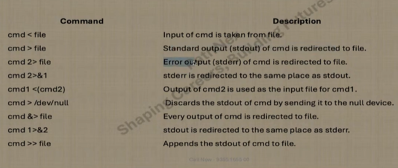
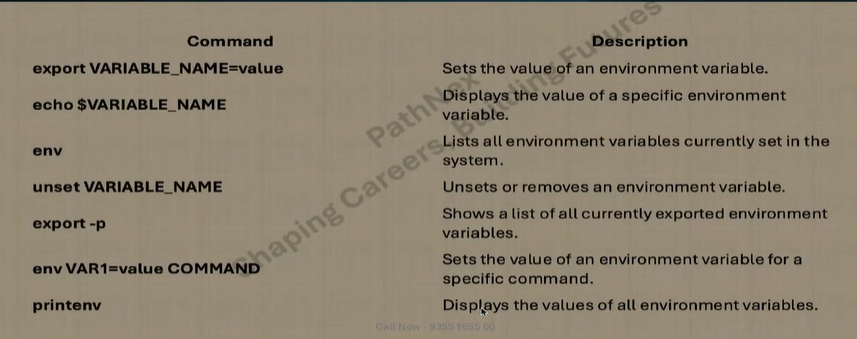
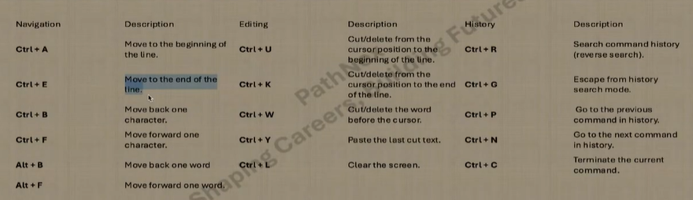
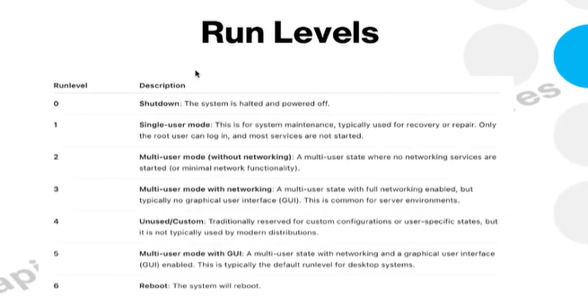

 

=======================
 
=======================
 
 ==========================
 ======================================
## What is the use of the `echo` command?

The `echo` command in Linux is used to display a line of text or string on the terminal. It is commonly used in shell scripts to output information, display variables, or print messages.

**Example:**
```bash
echo "Hello, World!"
```
This command will print `Hello, World!` to the terminal.

==================================

## How to check the computer name or hostname in Linux

To check the computer name (hostname) in Linux, you can use the `hostname` command:

```bash
hostname
```

This command will display the current hostname of your system.

Alternatively, you can use:

```bash
cat /etc/hostname
```

This will show the hostname as stored in the system configuration file.

====================================
## How to check the name of the current user in Linux terminal

To find out the name of the current user in the Linux terminal, use the `whoami` command:

```bash
whoami
```

This command will print the username of the currently logged-in user.

Alternatively, you can use:

```bash
echo $USER
```

This will display the username stored in the `USER` environment variable.

=============================================

## How to check your current path or working directory in Linux

To find out your current working directory in Linux, use the `pwd` command:

```bash
pwd
```

This command will print the full path of the directory you are currently in.

========================================
## How to see all users in Linux

To view all users on a Linux system, you can check the `/etc/passwd` file, which contains user account information:

```bash
cat /etc/passwd
```

This will list all users along with their details. To display only the usernames:

```bash
cut -d: -f1 /etc/passwd
```

This command extracts and prints just the usernames from the file.

====================================

## Difference between Relative and Absolute Path

In Linux, file and directory paths can be specified as either **relative** or **absolute**.

- **Absolute Path:**  
    An absolute path starts from the root directory (`/`) and specifies the complete location of a file or directory.  
    Example:  
    ```bash
    /home/user/documents/file.txt
    ```

- **Relative Path:**  
    A relative path specifies the location of a file or directory in relation to the current working directory.  
    Example:  
    ```bash
    documents/file.txt
    ```

**Summary:**  
Absolute paths always point to the same location, regardless of your current directory. Relative paths depend on where you are in the filesystem.

====================================
## How to create a file in Linux

To create a new file in Linux, you can use the `touch` command:

```bash
touch filename.txt
```

This command will create an empty file named `filename.txt` in the current directory.

Alternatively, you can use the `echo` command to create a file with some content:

```bash
echo "Sample text" > newfile.txt
```

This will create `newfile.txt` with the text "Sample text" inside it.
===========================================
## How to edit an existing file in Linux

To edit an existing file on a Linux server, you can use text editors such as `vi`, `vim`, or `nano`. These editors allow you to open, modify, and save files directly from the terminal.

- **vi/vim:**  
    Open a file with `vi` or `vim`:
    ```bash
    vi filename.txt
    ```
    or
    ```bash
    vim filename.txt
    ```
    Use the editor's commands to make changes and save the file.

- **nano:**  
    Open a file with `nano`:
    ```bash
    nano filename.txt
    ```
    Make your edits and save the file using the editor's shortcuts.

These editors are commonly used for editing configuration files, scripts, and other text files on Linux systems.

======================================
## How to rename a file in Linux

To rename a file in Linux, use the `mv` (move) command:

```bash
mv old_filename.txt new_filename.txt
```

This command changes the name of `old_filename.txt` to `new_filename.txt`.  
You can also use `mv` to move files to a different directory while renaming them.
==============================
## How to search for a string in a file in Linux

To search for a specific string in a file, use the `grep` command:

```bash
grep "search_string" filename.txt
```

This command will display all lines in `filename.txt` that contain `search_string`.

To ignore case sensitivity:

```bash
grep -i "search_string" filename.txt
```

To search recursively in all files within a directory:

```bash
grep -r "search_string" /path/to/directory
```
=================================
## Difference between `grep` and `egrep`

Both `grep` and `egrep` are used to search for patterns in files, but there are some differences:

- **`grep`:**  
    Searches for patterns using basic regular expressions.

- **`egrep`:**  
    Searches using extended regular expressions, which allow more complex patterns (like `+`, `?`, `|`, and parentheses without escaping).

**Example:**
```bash
grep "pattern" filename.txt
egrep "pattern" filename.txt
```

**Note:**  
`egrep` is deprecated. You can use `grep -E` for extended regular expressions:
```bash
grep -E "pattern" filename.txt
```
===================================
## how can you read a file without using cat command ?
==> using commands less more vi
====================================
## what is the advantages of using less command?
==> we can easily read big files.
==> forward and backward search is easily 
==. navigation form top to bottom is easy
=====================================
## how to check a file's permission ?
==> ls -l
===>getfact file_name (not found in MAC)
===============================
##  how to check the IP of your Linux server?
===> ifconfig
===> ip addr
=====================================
## how to read the top 5 lines in a file?
==> head -5 file_name
===================================
## how to read last 5 lines in a file?
==> tail -5 file_name
==========================
## how to lsit hidden files?
==> ls -la
## how to see all the recently used commands?
==> history 
## what is root?
==> admin or super user 
==> /root home directory for root user 
==> /root directory 
================================
## what is inode and how cto find it for a file?
==> df -i
==> is -li
==> inode is a index node . it serves as a unique identifier for a specific piece of metadata on a given filesystem

## which command can you use for finding files on linux system ?
==>
======================
## command for counting words aand files
==> wc
==> wc -l
===================
## how can you combine tow commands ? or what is pipe for used for ?
==> we can combine two commands using | 
==> ex: command1 | command2
==>pipe is used to combine two commands and redirect output of command 1 to command 2
=================================
## how to view the diff b/w two files?
==> diff file1 file2
==================================
## what is the use of the shred command? (premanently delete a file which is unable to recover)
==> shred -u file_name
==> shred --remove file_name
===================================
## how to check system architecture info?
==> dmidecode and iscpu
==>(not working in MAC)
===============================
## how to combine tow files
==> cat file1 file2
==> cat file1 file2 > file3
=============================
## how can you find the type of file?
==> file file_name
==============================
## how to sort the content of a file?
==> sort file_name
==> cat file_name | sort
================================
## diff ways to access a linux server remotely (from a windows machine)?
==>  using some tools and terminal like 
====> putty 
====> git bash
====> cmd
================================
## what are diff types of permissions for a file in linux?
==> Read(r)
==>Write(w)
==>Executable(x)
===================================
## which permission allow a user to run an executable file (script)
==> we need to provide executable (x) permission to the user
===============================
##  how  to write the output of a command inot a file ?
==> command > file_name 
==> usecase -cat test.txt>output.test.txt
=============================
## how to write something in a file without deleting the existing content?
==> we can append the file using >>
==> echo " new data entry $(date)" >> datafile.txt
==> echo "CPU usage : $(top -bn1 | grep "Cpu(s)" | sed "s/.*,*\({0-9.}*\)%*)
==> id.*/\1/" | awk '{print 100-$1}%">>cpu_usage.txt
==> echo "export PATH =\$PATH:/new/directory">>~/.beshrc
================================
## how to redirect an error of a command into a file?
==> to redirect an error we need to use 2>
==> to redirect both error and output,2>&1
=========================
## how to automate any task or script ?
==> using cron jobs -> a typical cron job entry looks like: 30 2**1/home/user/backup.sh
==> the at command is used to schedule one time tasks to run at a specific time in the future. unlike cron, which is for recurring tasks, at is used for single, one time jobs .
======> for example: at 3pm 
====================================

## how to check scheduled jobs 
==> crontab -l
==============================
## what is the meaning of this cron job ? *****
==>Yeh image ka **exact text** niche likh diya hai:

---


The cron job expression `* * * * *` means that the scheduled task will run **every minute of every hour of every day**. Specifically, it breaks down as follows:

* The first `*` (minute) means **every minute (0–59)**.
* The second `*` (hour) means **every hour (0–23)**.
* The third `*` (day of the month) means **every day of the month (1–31)**.
* The fourth `*` (month) means **every month (1–12)**.
* The fifth `*` (day of the week) means **every day of the week (0–6)**, where **0 is Sunday and 6 is Saturday**.

In other words, the task will execute **every single minute, all day, every day, indefinitely**.

This is often used for tasks that need to run very frequently, though you might want to be careful with it since it can put a heavy load on your system if not managed properly.

---

===================================
##  if your cron job did not work,how would you chekc?
==> check system time 
==> crontab entry
==> check /var/;og/messages
==============================
## what is daemon service ?
 service that keep running in background 
 ==> ex: httpd,sshd,chronyd

 =======================================

## how to check if a service is running or not ?
==> systemctl status service_name

=======================================

## how to start/stop any service?
==> systemctl start service_name
==>systemctl stop 
===============================
## how to chekc for free disk space?
==> we can use df command 
==> usecase -> df -h
==> help us to see the mounted disks
====================================
## how to chekc the size of a directory's content ?
==> we can use "du" command
===============================
##  how to check cpu usage for a process?
==> we can top command
===========================
## what is a process in linux?


An instance of a running program. Whenever you start a program/application or execute a command, a process is created.

For every process a unique no. is assigned which is called **PID (Process ID)**.

=========================
## how to check if a process/ application is running or not ?


Using **ps command**
Usecase → `ps aux | grep slack`

1. **a:** Lists processes of all users, not just the current user. Normally, ps shows processes belonging to the current user only, but with **a**, it includes processes from all users.

2. **u:** Displays the processes in a user-oriented format, showing information such as the user who started the process, CPU and memory usage, and the start time of the process.

3. **x:** Includes processes that don't have a controlling terminal (such as background processes and system services). Normally, ps only shows processes running in a terminal session, but **x** will show all processes.


==============================
**How to terminate/stop a running process?**

Using **kill command**
Usecase → `kill -9 76569`

**-9:** This is the signal number (**SIGKILL**), which forcefully kills a process. The **-9** signal cannot be caught or ignored by the process, so it guarantees that the process is terminated immediately.
============================
## how to check if a IP? server is accessible or not?


=================================
**How to check open port in Linux system?**

`netstat -tuln | grep port_no`

Usecase → `netstat -tuln | grep 80`

* **-t:** Displays TCP ports.
* **-u:** Displays UDP ports.
* **-l:** Lists only listening ports.
* **-n:** Shows numeric addresses (avoids resolving hostnames).
====================================

**Ques: 52**

**Common Use Cases for `lsof`**

**Identify Which Processes Are Using a Specific File** – You can use `lsof` to check which process has a particular file open. This is useful when you need to know which application or service is currently accessing or locking a file.

**Example:**
`lsof /path/to/file` – This command will show all processes that have `/path/to/file` open.

**Finding Open Files by a Specific Process** – You can list all open files for a specific process by using its PID (Process ID).

**Example:**
`lsof -p <PID>` – This shows all open files by the process with ID `<PID>`.

**Identify Which Process Is Using a Specific Port** – This is very useful for troubleshooting network issues or checking which service is listening on a specific port. For instance, if you're unsure which process is using port 80 (HTTP), you can run:

**Example:**
`lsof -i :80` – This will show all processes that are listening on port 80.
=================================
## how to check network interfaces in linuz
==> we can use ifconfig and netstat command
=============================
## diff b/w Telnet and ssh ?
==> SSH is secured
TELNET is not secured
==============================
## whcih service should be running on server to allow you ti connect remotely ?
==> ssh and sshd
==============================
## what is SSH 
==>SSH or Secure Shell is a network communication protocol that enables two computers/devices to communicate and share data.
============================
## why SSH caleed as secure shell ?
==> the communincation b/w host and client will be encrypted format
=============================
## run levels 


=========================
**What is rsync?**
A tool to **sync files between locations**, transferring only **changed parts**.

**Syntax**
`rsync [options] SRC DEST`

**Key Options**

* **-a:** Archive (preserve attributes)
* **-v:** Verbose (details)
* **-z:** Compress
* **-r:** Recursive (for dirs)
* **-u:** Update (skip newer files)
* **-n:** Dry-run
* **-e:** Remote shell (SSH)
* **--delete:** Delete in DEST not in SRC
* **-P:** Progress & partial transfers

**Examples**

**Local to local:**
`rsync -av /src/ /dst/`

**Local to remote:**
`rsync -avz /src/ user@remote:/dst/`

**Dry-run:**
`rsync -av --dry-run /src/ /dst/`
============================
Linux interview me aksar **`$0`, `$1`, `$#`, `$@`, `$?`** jaise **shell special variables** puchhe jaate hain. Shayad aapko **`$0` aur `$?` ya `$1`** yaad aa raha hoga. Ye **Bash scripting** se related hote hain.

Yaha important ones samjho 👇

---

### 1️⃣ `$0`

Script ka **name** batata hai.

Example:

```bash
#!/bin/bash
echo $0
```

Run karne par output:

```
script.sh
```

---

### 2️⃣ `$1`, `$2`, `$3`

Ye **command line arguments** hote hain.

Example:

```bash
#!/bin/bash
echo $1
echo $2
```

Run:

```bash
./script.sh hello world
```

Output:

```
hello
world
```

---

### 3️⃣ `$#`

Total **arguments ki count** batata hai.

Example:

```bash
echo $#
```

Run:

```bash
./script.sh a b c
```

Output:

```
3
```

---

### 4️⃣ `$?`

Last command **successful thi ya nahi** batata hai.

* `0` → success
* non-zero → error

Example:

```bash
ls
echo $?
```

---

### 5️⃣ `$@`

Saare arguments ko **list form me** represent karta hai.

Example:

```bash
echo $@
```

---

### 🔥 Interview me commonly pucha jata hai

* What is **`$0` in shell script?**
* Difference between **`$@` and `$*`**
* What does **`$?` mean in Linux?**
* What is **`$#` in bash?**

---


